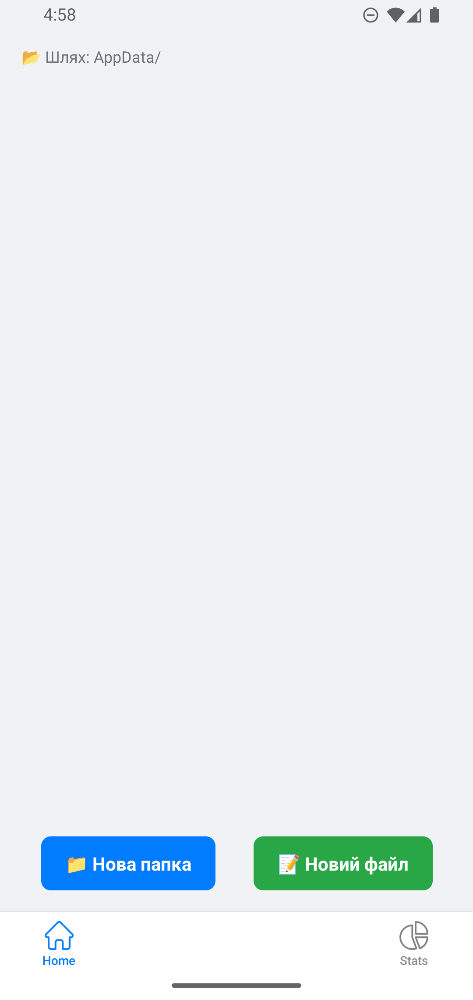
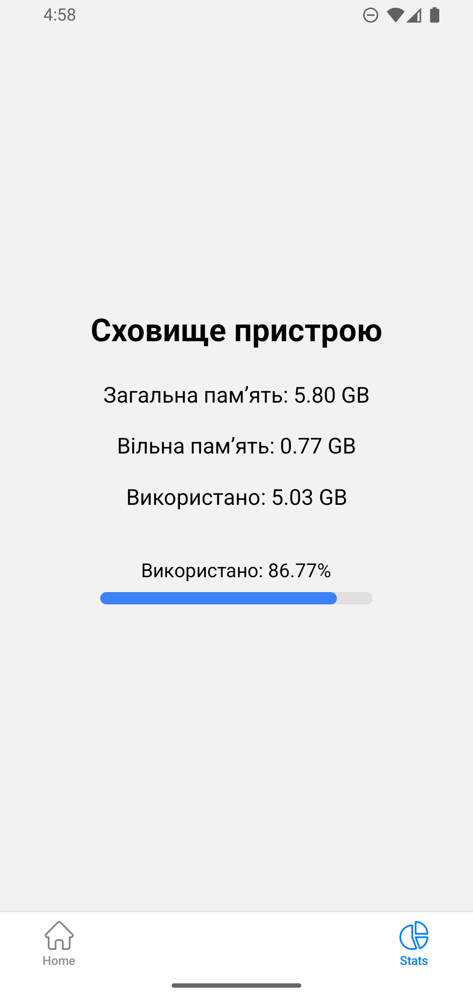
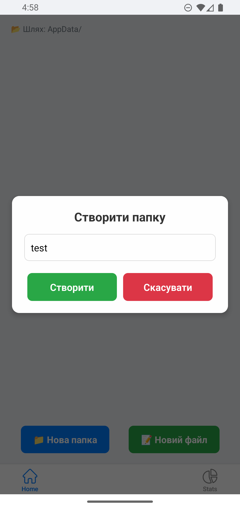
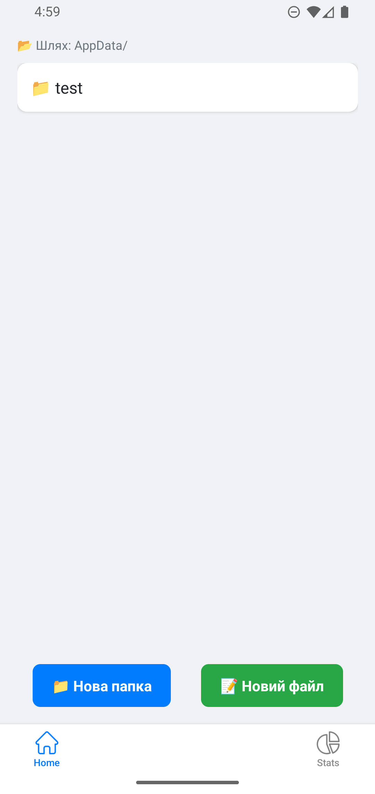
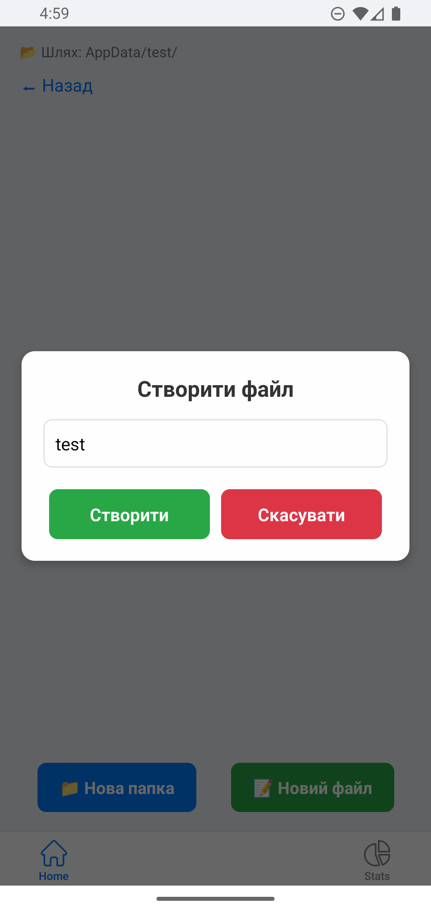
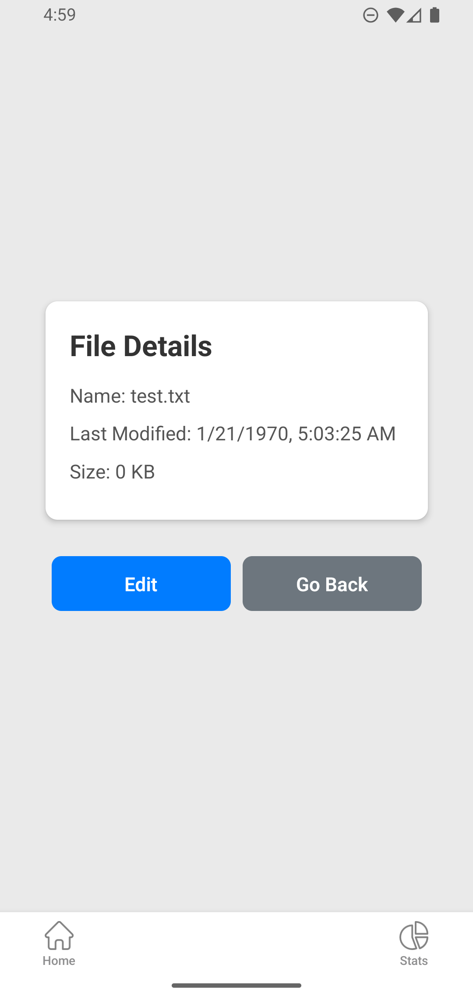
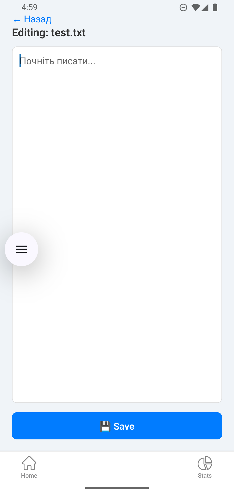
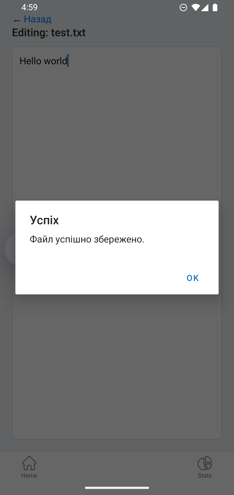
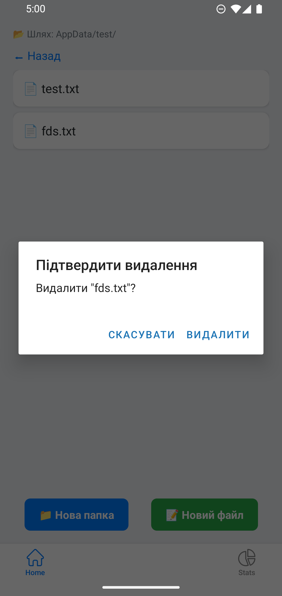

# Лабораторна робота №5

Виконав: Незнайко Віталій, група ВТк-24-1

# Запуск проєкту

```sh
npx expo start --android
```

# Скріншоти:
### Головна сторінка



### Сторінка статистики



### Створення папки


### Створена папка


### Створення файла в середині папки


### Деталі файла


### Редактор вмісту файла


## Збереження змін у файлі


## Видалення

